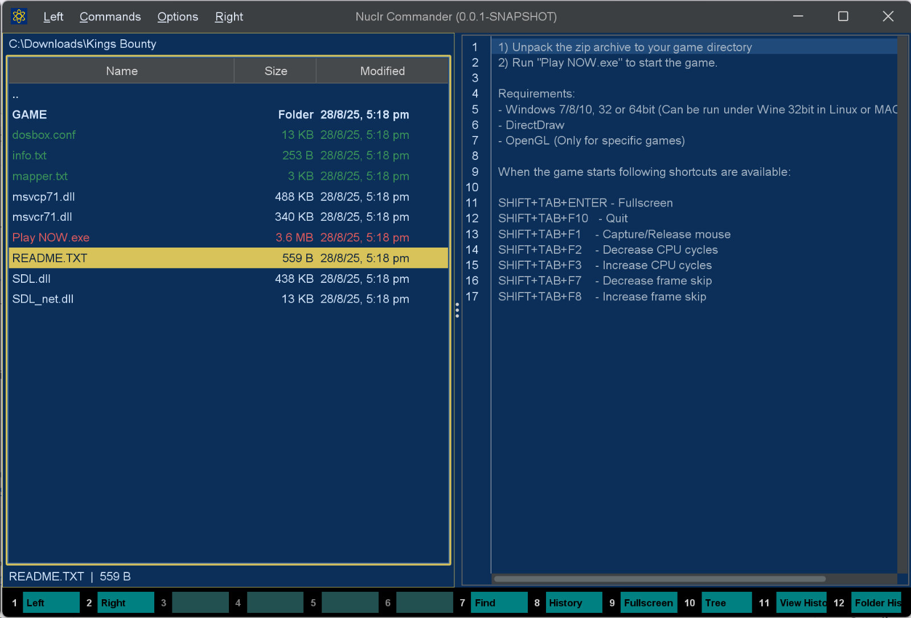

# ⚡ Text Quick Viewer

> Syntax-highlighted instant previews for text and source files inside [Nuclr Commander](https://nuclr.dev).

No tab switching. No app hopping. Just hit **Ctrl+Q** and get the file in front of you, fast. 😎



## 🚀 What It Does

- 🔥 Syntax highlighting for 50+ languages and formats via RSyntaxTextArea
- 🧭 Line numbers for quick scanning and reference
- 🪄 Code folding where the language supports it
- 🌑 Dark styling that fits Commander without looking bolted on
- 🛡️ Large-file guard that stops previews over 10 MB from freezing the UI
- 🧪 Binary-file detection that quietly skips files that should not be rendered as text
- 📦 NIO.2 support, including files inside ZIP and JAR archives
- ⛔ Cancellation-aware loading so switching files does not leave stale content behind

## 🎯 Supported File Types

| Category | Extensions |
|----------|-----------|
| Plain text | `txt`, `log`, `csv`, `md` |
| Web | `html`, `htm`, `css`, `js`, `mjs`, `ts`, `tsx`, `jsp` |
| Data / config | `json`, `yaml`, `yml`, `toml`, `ini`, `conf`, `cfg`, `properties`, `prefs`, `pref` |
| JVM | `java`, `kt`, `scala`, `groovy`, `gradle` |
| Systems | `c`, `cpp`, `h`, `hpp`, `cs`, `go`, `rs` |
| Scripting | `py`, `rb`, `php`, `lua`, `perl`, `pl`, `dart`, `sql` |
| Shell / scripts | `sh`, `bash`, `bat`, `cmd`, `ps1` |
| XML / markup | `xml`, `svg`, `html`, `htm`, `jsp`, `csproj`, `classpath`, `project`, `factorypath` |
| IDE / project | `vsconfig`, `firebaserc` |
| Dotfiles | `.gitignore`, `.gitattributes`, `.meta` |
| Container | `dockerfile` |

## 📥 Installation

Copy the signed plugin archive and detached signature into the Nuclr Commander `plugins/` directory:

```text
quick-view-text-<version>.zip
quick-view-text-<version>.zip.sig
```

Nuclr Commander verifies the RSA-SHA256 signature against `nuclr-cert.pem` on load. The plugin becomes available immediately without a restart.

## 🧠 How It Works

```text
TextQuickViewProvider  → decides whether a file looks like supported text
TextQuickViewPanel     → loads content and renders it in RSyntaxTextArea
```

### Loading flow

1. `supports(resource)` checks the extension with no I/O.
2. `openResource(resource, cancelled)` delegates to `TextQuickViewPanel.load(...)` on a virtual thread.
3. Loading performs:
   - file-size guard (10 MB limit)
   - binary scan of the first 8 KB
   - content read via `Path` or `InputStream`
   - EDT handoff for final UI update
4. `setText(...)` selects the syntax style and swaps in a fresh document.

### Threading model

- **EDT**: Swing updates, document swaps, repainting
- **Virtual thread**: file I/O and binary detection
- **`AtomicBoolean cancelled`**: prevents stale UI updates when the user changes selection mid-load

## 🗂️ Source Layout

```text
src/main/java/dev/nuclr/plugin/core/quick/viewer/
├── TextQuickViewProvider.java   plugin entry point, format detection
└── TextQuickViewPanel.java      Swing panel, loading, syntax highlighting
```

## 📚 Dependencies

| Library | Version | Purpose |
|---|---|---|
| `dev.nuclr:platform-sdk` | `3.0.1` | Nuclr platform interfaces |
| `rsyntaxtextarea` | `3.6.1` | Syntax-highlighted text rendering |

## 📄 License

Apache 2.0. See [LICENSE](LICENSE).
